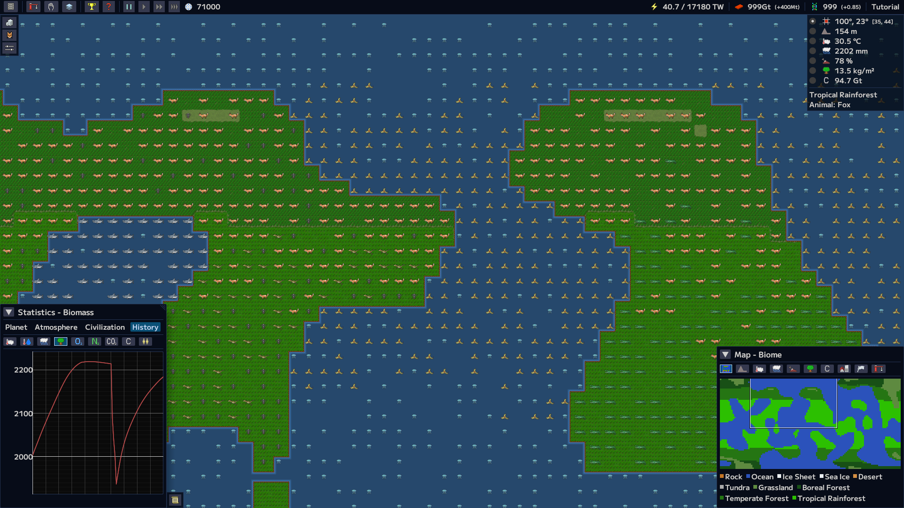
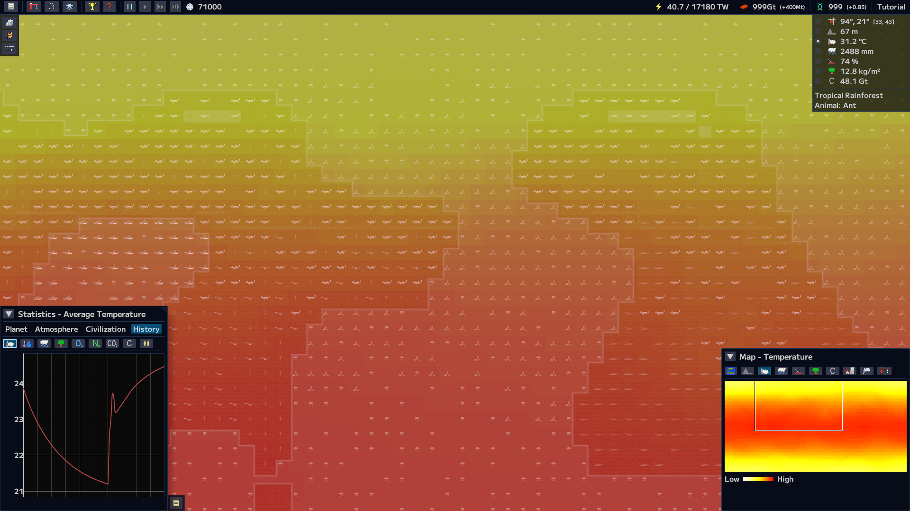
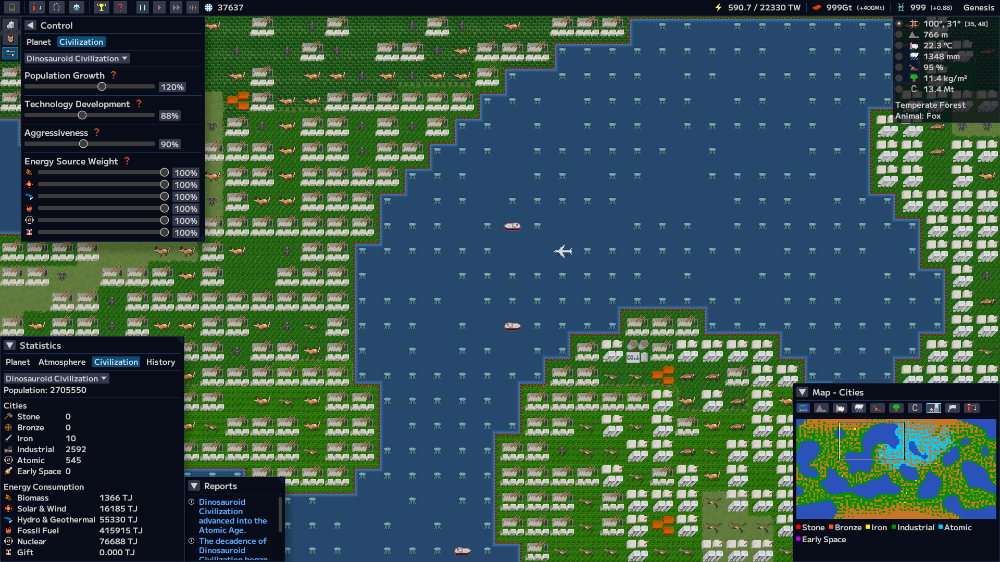

# Garkimasera Games

Games made by [@garkimasera](https://github.com/garkimasera).

## 

Planet and terraforming simulation game.

### Features

* Simulation of the entire planet based on real physics and geology.
* Detailed simulation of temperature, biomass, carbon cycle, insolation, and atmospheric composition.
* Dynamic gameplay where player actions impact the entire planet.
* Resource acquisition via fusion reactors, Dyson swarms, and more.
* Various facilities and methods for terraforming (e.g., oxygen generators, aerosol injection).
* Animal breeding and habitat expansion.
* Simulation of civilizations' evolution and their planetary impact.
* Various dynamic events affecting civilizations, such as plagues and wars.
* Multiple distinct planet types to terraform.

### Screenshots

### Links

## Rusted Ruins

Extensible open world rogue like game with pixel art.

### Screenshots

### Links

